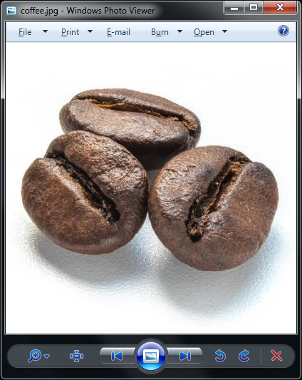

# Borderless Window Tool

"Borderless Window Tool" is a very simple tool that forces most application windows into borderless windowed mode. Optionally, you can also resize the window to full screen.

## Installation
You can download a file specific to your system architecture (64 or 32 bit) from [Releases](https://github.com/coffeegreg/borderless-window-tool/releases) or build the "Borderless Window Tool" from source (see [Build](README.md#build) section).

## Usage
Just run `BorderlessWindowTool.exe` with the `-l` or `--list` param to list the available windows titles. Select one from the list and run `BorderlessWindowTool.exe` with the `-w` or `--window=` parameter and add the window title of your choice.
>Tip: Use apostrophes if the window title contains spaces or any non-standard characters.

Add `-b` or `--borderless` param to make window borderless.  
Add `-f` or `--fullscreen` param to display the window in full screen.  
Use `-h` or `--help` for a help screen.

>Tip: You can automate your application startup with a simple `.cmd` or `.bat` file with the following example statement: 
>```
>start "" "your_application.exe"
>timeout 3
>BorderlessWindowTool.exe -w "Your Application Window Tile" -b -f
>```


## Effect
  

## Build
You can use [Lazarus Free Pascal RAD IDE](https://www.lazarus-ide.org/) or [CodeTyphon Studio](https://www.pilotlogic.com) to build "Borderless Window Tool".  
Relevant project files are included.

## License
"Borderless Window Tool" is licensed under MIT license.
See the [license.txt](LICENSE.txt) file for more details.
